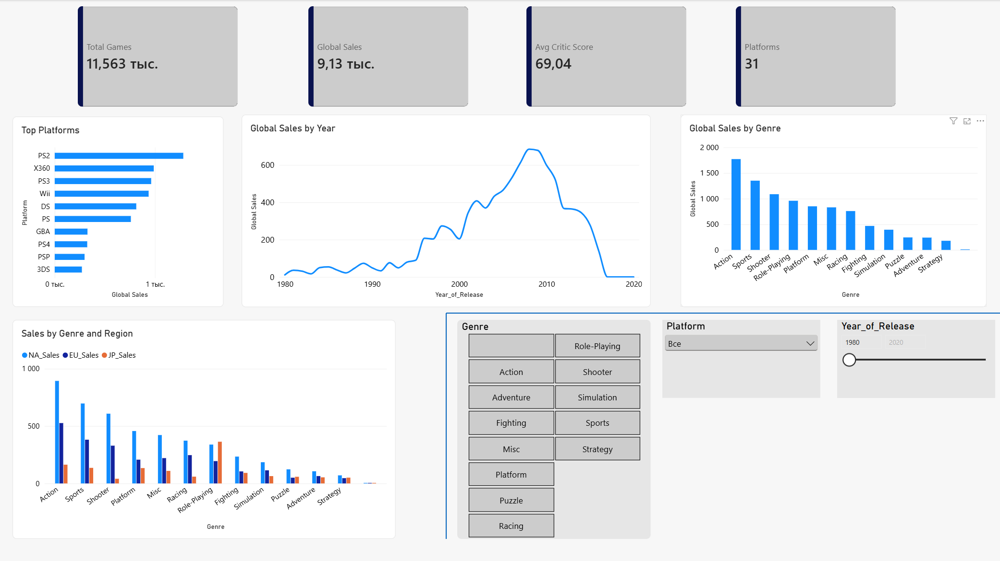

# 🎮 Анализ продаж видеоигр | Python • SQL • Power BI

## 📌 О проекте

Комплексный проект по анализу данных о мировых продажах видеоигр.

Цель проекта — исследовать рынок видеоигр, определить основные тенденции и проанализировать продажи по платформам, жанрам, регионам и годам.

Проект демонстрирует работу с одним набором данных с использованием нескольких аналитических инструментов:

**Python → очистка и исследовательский анализ данных → SQL → аналитические запросы → Power BI → интерактивный дашборд**

---

## 🛠 Используемые инструменты

- **Python:** Pandas, NumPy, Matplotlib
- **SQL:** PostgreSQL
- **Power BI:** Power Query, DAX, Data Modeling
- **Jupyter Notebook**
- **DBeaver**

---

## 📂 Файлы проекта

- `Video_Games.csv` — исходный датасет
- `Video_Games_Capstone.ipynb` — очистка, исследовательский анализ и визуализация данных в Python
- `video_games_analysis.sql` — SQL-анализ данных
- `Video_Games_Dashboard.pbix` — интерактивный Power BI Dashboard
- `video_games_dashboard.png` — изображение готового дашборда

---

## 📊 Датасет

В проекте используется датасет, содержащий около **17 000 записей о видеоиграх**.

Основные данные:

- название игры;
- платформа;
- жанр;
- год выпуска;
- издатель;
- продажи в Северной Америке;
- продажи в Европе;
- продажи в Японии;
- глобальные продажи;
- оценки критиков;
- оценки пользователей.

---

# 🐍 Python — анализ и подготовка данных

Python использовался для подготовки, очистки, исследования и визуализации данных.

## Основные этапы

- загрузка и первичное изучение данных;
- проверка структуры и типов данных;
- обработка пропущенных значений;
- удаление дубликатов;
- преобразование типов данных;
- анализ продаж по платформам;
- анализ продаж по жанрам;
- анализ продаж по регионам;
- анализ динамики продаж по годам;
- визуализация результатов.

## Использованные библиотеки

`Pandas` `NumPy` `Matplotlib`

## Продемонстрированные навыки

`Data Cleaning` `EDA` `Data Aggregation` `Data Visualization`

---

# 🗄 SQL — аналитические запросы

PostgreSQL использовался для дополнительного анализа данных с помощью SQL-запросов.

## Выполненный анализ

- расчёт общего объёма продаж;
- расчёт средних продаж;
- анализ продаж по жанрам;
- определение наиболее успешных платформ;
- поиск самых продаваемых игр;
- анализ издателей;
- фильтрация агрегированных результатов;
- сегментация игр по показателям продаж;
- ранжирование игр внутри жанров.

## Использованные возможности SQL

`SELECT` `WHERE` `GROUP BY` `ORDER BY` `HAVING`

`COUNT` `SUM` `AVG`

`CASE WHEN`

`Subqueries`

`ROW_NUMBER()`

`PARTITION BY`

`Window Functions`

---

# 📈 Power BI — интерактивный дашборд

На основе подготовленных данных создан интерактивный Power BI Dashboard для анализа рынка видеоигр.

## Основные KPI

- **Total Games** — количество игр;
- **Global Sales** — глобальные продажи;
- **Average Critic Score** — средняя оценка критиков;
- **Platforms** — количество игровых платформ.

## Основные визуализации

- Top Platforms;
- Global Sales by Year;
- Global Sales by Genre;
- Sales by Genre and Region.

## Интерактивные фильтры

Дашборд позволяет фильтровать данные по:

- жанру;
- платформе;
- году выпуска.

Также можно сравнивать продажи между основными регионами:

- North America (NA);
- Europe (EU);
- Japan (JP).

---

## 📊 Power BI Dashboard

---

# 🔎 Основные выводы

По результатам анализа были выявлены следующие тенденции:

- продажи видеоигр значительно выросли в 2000-х годах и достигли наиболее высоких значений в конце 2000-х;
- жанр **Action** является одним из лидирующих по глобальным продажам;
- предпочтения пользователей отличаются между Северной Америкой, Европой и Японией;
- значительная часть глобальных продаж приходится на наиболее популярные игровые платформы;
- популярность платформ и жанров менялась в зависимости от периода.

---

# 💡 Продемонстрированные навыки

### Data Analytics

- Data Cleaning
- Exploratory Data Analysis (EDA)
- Data Aggregation
- Data Visualization
- интерпретация результатов анализа

### Python

- Pandas
- NumPy
- Matplotlib

### SQL

- PostgreSQL
- агрегатные функции
- GROUP BY / HAVING
- CASE
- подзапросы
- оконные функции

### Power BI

- Power Query
- DAX
- Data Modeling
- KPI
- Interactive Dashboards
- Data Visualization

---

# 🎯 Цель проекта

Проект создан в рамках моего портфолио **Data Analytics** и демонстрирует полный цикл работы с данными с использованием нескольких инструментов.

В рамках одного проекта были выполнены:

**подготовка данных → исследовательский анализ → SQL-анализ → визуализация → создание интерактивного дашборда → формирование выводов.**

Проект демонстрирует способность использовать **Python, PostgreSQL и Power BI** для решения аналитических задач и представления результатов анализа в понятной форме.

---

## 👤 Автор

**Ismail Djaid**

Marketing & Data Analytics

**GitHub:** [ismail-djaid](https://github.com/ismail-djaid)
